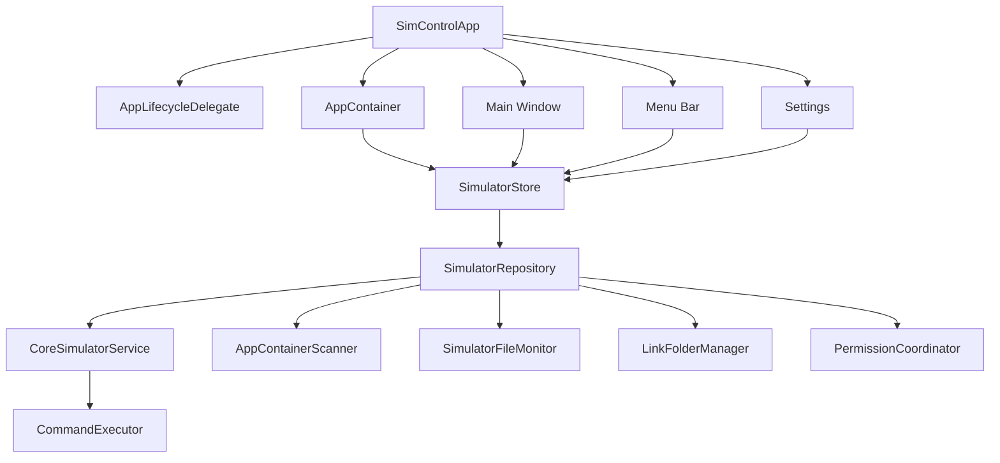

# SimControl Architecture

SimControl is a macOS app for managing Xcode Simulator devices and installed applications. It combines a full SwiftUI management window with a persistent menu bar interface. Both surfaces use the same state store, command execution layer, and simulator services.

The app remains running after the main window is closed. The menu bar controller stays active until the user explicitly quits SimControl.

## System Overview

SimControl is organized around a small application core shared by multiple UI surfaces.



The UI sends user intent to `SimulatorStore`. The store coordinates long-running work through `SimulatorRepository`, then publishes updated state back to the UI. Process execution, file scanning, monitoring, link management, and permission handling stay outside the UI layer.

## Application Lifecycle

`SimControlApp` owns the SwiftUI scenes:

- `WindowGroup` for the main management window
- `MenuBarExtra` for quick actions
- `Settings` for preferences and environment information
- `Commands` for app-level menu commands and shortcuts

`AppLifecycleDelegate` prevents the app from quitting when the last window closes.

```swift
final class AppLifecycleDelegate: NSObject, NSApplicationDelegate {
  func applicationShouldTerminateAfterLastWindowClosed(_ sender: NSApplication) -> Bool {
    false
  }
}
```

SimControl starts as a regular macOS app with Dock and Cmd-Tab presence. A later setting can hide the Dock icon while keeping window reopening, settings, and quit actions available from the menu bar.

## Composition Root

`AppContainer` creates and holds the long-lived objects used by the app:

```text
AppContainer
  SettingsStore
  CommandExecutor
  CoreSimulatorService
  AppContainerScanner
  SimulatorFileMonitor
  LinkFolderManager
  PermissionCoordinator
  SimulatorRepository
  SimulatorStore
```

Concrete service construction is kept here so views do not need to know how simulator services are built. Views interact with `SimulatorStore` and render state derived from it.

## State Model

The main state object is `SimulatorSnapshot`. It is an immutable representation of the current simulator environment.

```text
SimulatorSnapshot
  generatedAt
  xcode
  runtimes
  deviceTypes
  devices
  pairs
  installedAppsByDeviceID
  warnings
```

Core domain values are simple value types:

```text
XcodeSelection
  developerPath
  version
  isValid

SimulatorRuntime
  id
  name
  version
  buildVersion
  platform
  isAvailable
  supportedDeviceTypeIDs

SimulatorDevice
  id
  udid
  name
  runtimeID
  deviceTypeID
  platform
  state
  isAvailable
  dataPath
  logPath
  lastBootedAt
  dataPathSize

InstalledApp
  id
  bundleID
  displayName
  version
  build
  deviceID
  bundleContainer
  dataContainer
  appBundlePath
  appGroups
  icon

AppGroupContainer
  id
  groupID
  path

DevicePair
  id
  phoneDeviceID
  watchDeviceID
  state
```

Modern `simctl list -j` fields such as `isAvailable`, `platform`, `supportedDeviceTypes`, `deviceTypeIdentifier`, and `dataPath` are used when present. Runtime or platform inference from display names is only a fallback.

## Store

`SimulatorStore` is the UI-facing state owner. It runs on the main actor and exposes:

```text
snapshot
refreshState
selectedDeviceID
selectedAppID
filters
searchQuery
actionStates
lastCommandResults
permissionState
settings
```

The store accepts user intent such as refresh, select device, boot, shutdown, launch app, open container, create device, erase device, open settings, and quit. It starts asynchronous repository work, guards against duplicate actions, records command results, and publishes new UI state.

The store does not execute shell commands, scan files, create links, or parse `simctl` JSON directly.

## Repository

`SimulatorRepository` coordinates simulator reads and writes. It serializes refresh work, calls simulator services, asks the scanner for installed apps, updates link-folder state, and returns immutable snapshots.

A refresh follows this shape:

1. Read the active Xcode developer path.
2. Run `simctl list -j`.
3. Decode runtimes, device types, devices, and pairs.
4. Connect devices to runtimes and pairs.
5. Scan app containers for each device.
6. Collect warnings and permission issues.
7. Return a new `SimulatorSnapshot`.

Command actions follow this shape:

1. Validate the target and current state.
2. Run the typed `CoreSimulatorService` command.
3. Record the command result.
4. Refresh affected state when needed.

## Command Execution

`CommandExecutor` is the only layer that launches external processes. It returns a complete command result:

```text
CommandResult
  executable
  arguments
  stdout
  stderr
  exitCode
  duration
  startedAt
```

Commands run asynchronously. Failures preserve stderr and exit code so users can diagnose Xcode and simulator problems.

## CoreSimulator Service

`CoreSimulatorService` wraps `xcrun simctl` with typed methods:

```text
selectedXcodePath()
list()
boot(deviceID)
shutdown(deviceID)
openSimulatorApp()
launchApp(deviceID, bundleID)
terminateApp(deviceID, bundleID)
uninstallApp(deviceID, bundleID)
installApp(deviceID, appBundlePath)
createDevice(name, deviceTypeID, runtimeID)
cloneDevice(sourceID, name)
renameDevice(deviceID, name)
eraseDevice(deviceID)
deleteDevice(deviceID)
pair(phoneID, watchID)
unpair(pairID)
getAppContainer(deviceID, bundleID, kind)
listApps(deviceID)
openURL(deviceID, url)
push(deviceID, payloadPath, bundleID)
setPrivacy(deviceID, service, bundleID, value)
setLocation(deviceID, location)
captureScreenshot(deviceID, outputPath)
recordVideo(deviceID, outputPath)
```

Service methods do not update UI state. They execute commands and return typed results to the repository.

## App Container Scanner

`AppContainerScanner` reads CoreSimulator folders to discover installed apps, including apps on shutdown simulators.

It scans:

```text
~/Library/Developer/CoreSimulator/Devices/<UDID>/data/Containers/Bundle/Application
~/Library/Developer/CoreSimulator/Devices/<UDID>/data/Containers/Data/Application
~/Library/Developer/CoreSimulator/Devices/<UDID>/data/Containers/Shared/AppGroup
```

The scanner matches bundle and data containers using `.com.apple.mobile_container_manager.metadata.plist`, then reads app metadata from `.app/Info.plist`. It also discovers App Groups, app icons, common database files, and container paths.

CoreSimulator internal layout can change between Xcode versions, so scanner failures are reported as warnings instead of app crashes.

## File Monitoring

`SimulatorFileMonitor` watches CoreSimulator paths and emits refresh events when simulator or app state changes. Events are debounced before the repository refreshes state.

Watched paths include:

- CoreSimulator device root
- Device `device.plist` files
- Bundle container folders
- Data container folders
- App Group folders

If monitoring fails, manual refresh remains available.

## Link Folder Manager

`LinkFolderManager` creates an optional symbolic-link tree for quick access to app containers.

```text
<Link Root>/
  <Runtime Name>/
    <Device Name or Device Name_UDID>/
      <App Name or App Name_BundleID>/
        Bundle -> <Bundle Container>
        Sandbox -> <Data Container>
      AppGroups/
        <Group ID> -> <App Group Container>
```

The feature is user-controlled. It only runs after a root folder is selected. Rebuild and cleanup operations work from the current simulator snapshot and avoid touching unrelated files.

## Permissions

`PermissionCoordinator` distinguishes missing data from permission failures. It reports read failures for CoreSimulator folders and write failures for link folders or output folders.

The app is designed as a developer utility. If a sandboxed distribution is supported, folder access will use user-selected locations and security-scoped bookmarks.

## Main Window

The main window is optimized for browsing and repeated management work.

```text
Toolbar
  Refresh | Open Simulator | Create | Search | Settings

Sidebar
  Platforms
  Runtimes
  Device States
  Pinned Devices

Content
  Device list or table

Inspector
  Device summary
  Quick actions
  Installed apps
  App Groups
  Recent command results
```

The first screen is the simulator management interface.

## Menu Bar

The menu bar renders from the shared snapshot. It provides quick access to pinned devices, recent devices, all devices, common device actions, installed app actions, settings, and quit.

Menu actions call the same store intents as the main window. Complex actions can open a small dialog or bring the main window forward.

## Settings

Settings are grouped by purpose:

- General behavior
- Xcode environment
- Menu bar rendering
- Link folder
- Safety confirmations
- Diagnostics and about information

Settings are persisted and applied through `SettingsStore`.

## Persistence

SimControl stores user preferences and lightweight app state:

- Settings
- Pinned devices and apps
- Recent targets
- Link folder root
- Last selected device and app
- Recent command results
- Saved tool presets

Simulator snapshots are rebuilt from `simctl` and CoreSimulator data. App data contents are not stored.

## Error Handling

Errors are normalized into user-facing categories while preserving technical details:

- Xcode not selected
- `simctl` command failed
- JSON decode failed
- CoreSimulator path unavailable
- Permission denied
- App container not found
- File operation failed
- Destructive action cancelled

Refresh failures keep the last successful snapshot visible and mark it stale.

## Safety

Destructive actions use a shared confirmation flow. This includes app uninstall, device erase, device delete, sandbox reset, and stale link cleanup.

The confirmation view identifies the affected device, app, identifier, and path when available. Commands also validate preconditions before running, so impossible actions are disabled before execution.

## Project Structure

```text
SimControl/
  App/
    SimControlApp.swift
    AppLifecycleDelegate.swift
    AppContainer.swift
  Domain/
    SimulatorSnapshot.swift
    SimulatorRuntime.swift
    SimulatorDevice.swift
    SimulatorDeviceType.swift
    InstalledApp.swift
    DevicePair.swift
    ActionResult.swift
  Services/
    CommandExecutor.swift
    CoreSimulatorService.swift
    SimctlModels.swift
    AppContainerScanner.swift
    LinkFolderManager.swift
    SimulatorFileMonitor.swift
    PermissionCoordinator.swift
  State/
    SimulatorStore.swift
    SettingsStore.swift
    ActionLogStore.swift
  Features/
    MainWindow/
    MenuBar/
    Settings/
    CreateDevice/
  SharedUI/
```

The structure keeps platform commands, simulator parsing, file-system work, and SwiftUI presentation separate so each piece can be tested independently.
