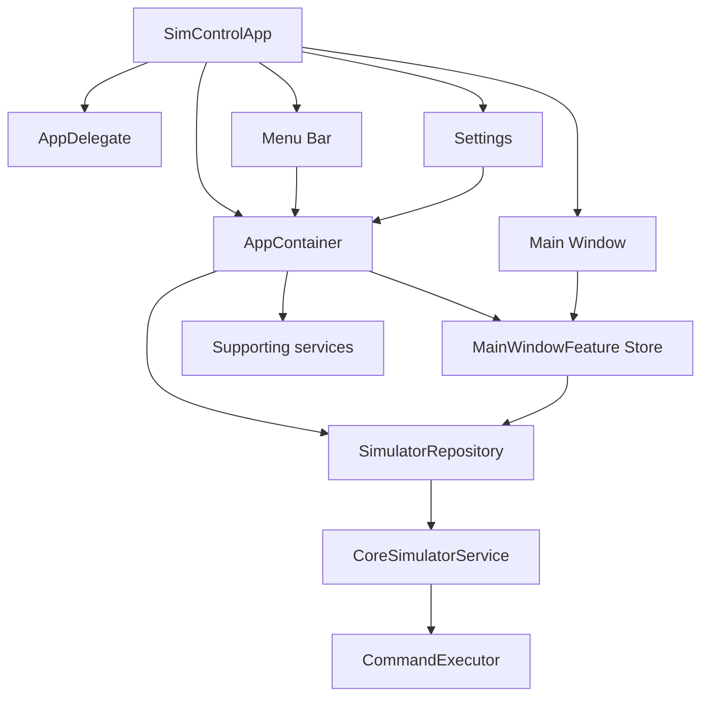

# SimControl Architecture

SimControl is a macOS app for managing Xcode Simulator devices and installed applications. It combines a full SwiftUI management window with a persistent menu bar interface. The main window owns its UI state through TCA features and shares the command execution layer and simulator services through the app container.

The app remains running after the main window is closed. The menu bar controller stays active until the user explicitly quits SimControl.

## System Overview

SimControl is organized around a small application core shared by multiple UI surfaces.



The main-window UI sends user intent to scoped TCA stores. `MainWindowFeature` is the root effect boundary: it coordinates refresh work through `SimulatorRepository`, then publishes updated state through child features. Process execution stays outside the UI layer. File scanning, monitoring, link management, and permission handling live in dedicated services that can be wired into features as each surface needs them.

## Application Lifecycle

`SimControlApp` owns the SwiftUI scenes:

- `WindowGroup` for the main management window
- `MenuBarExtra` for quick actions
- `Settings` for preferences and environment information
- `Commands` for app-level menu commands and shortcuts

`AppDelegate` prevents the app from quitting when the last window closes.

```swift
final class AppDelegate: NSObject, NSApplicationDelegate {
  func applicationShouldTerminateAfterLastWindowClosed(_ sender: NSApplication) -> Bool {
    false
  }
}
```

SimControl starts as a regular macOS app with Dock and Cmd-Tab presence. A later setting can hide the Dock icon while keeping window reopening, settings, and quit actions available from the menu bar.

## Composition Root

`AppContainer` creates and holds the long-lived objects used by the app:

```text
AppContainer
  SettingsStore
  ActionLogStore
  CommandExecutor
  CoreSimulatorService
  SimulatorRepository
  MainWindowFeature Store
```

Concrete service construction is kept here so views do not need to know how simulator services are built. Main-window views interact with scoped TCA stores and render state derived from those feature states.

## State Model

The main state object is `SimulatorSnapshot`. It is an immutable representation of the current simulator environment.

```text
SimulatorSnapshot
  generatedAt
  xcode
  runtimes
  deviceTypes
  devices
  pairs
  installedAppsByDeviceID
  warnings
```

Core domain values are simple value types:

```text
XcodeSelection
  developerPath
  version
  isValid

SimulatorRuntime
  id
  name
  version
  buildVersion
  platform
  isAvailable
  supportedDeviceTypeIDs

SimulatorDevice
  id
  udid
  name
  runtimeID
  deviceTypeID
  platform
  state
  isAvailable
  dataPath
  logPath
  lastBootedAt
  dataPathSize

InstalledApp
  id
  bundleID
  displayName
  version
  build
  deviceID
  bundleContainer
  dataContainer
  appBundlePath
  appGroups
  icon

AppGroupContainer
  id
  groupID
  path

DevicePair
  id
  phoneDeviceID
  watchDeviceID
  state
```

Modern `simctl list -j` fields such as `isAvailable`, `platform`, `supportedDeviceTypes`, `deviceTypeIdentifier`, and `dataPath` are used when present. Runtime or platform inference from display names is only a fallback.

## Store

The main-window UI state is owned by TCA features. `MainWindowFeature` is the root effect boundary and exposes:

```text
sidebar
workspace
task
refreshButtonTapped
refreshResponse
```

Refresh effects, duplicate refresh guards, and command-result normalization live at the root. The root scopes state and actions into child features instead of passing selection values and closures through view initializers.

`WorkspaceFeature` owns snapshot-derived browsing state:

```text
snapshot
refreshState
deviceList.selectedDeviceID
deviceDetail.installedApps.selectedAppID
commandResults
inspector
```

MainWindow feature-local shared state is split into:

```text
InventoryRefreshState
InstalledAppsAvailability
```

State-owning screens are split into child features: `SidebarFeature`, `DeviceListFeature`, `DeviceDetailFeature`, `InstalledAppsFeature`, and `InspectorFeature`. `SidebarFeature` is currently read-only summary state with an `EmptyReducer`; sidebar filtering and navigation are deferred to the search/filter phase. Pure rendering views such as rows, headers, section labels, and command result cells remain initializer-based.

The TCA store accepts user intent such as refresh, select device, and select installed app. It starts asynchronous repository work, guards against duplicate refreshes, records command results, and publishes new UI state.

The store does not execute shell commands, scan files, create links, or parse `simctl` JSON directly.

## Repository

`SimulatorRepository` currently coordinates simulator inventory reads. It serializes refresh work, calls simulator services, maps service-layer `simctl list -j` values into domain values, and returns immutable snapshots.

The current refresh follows this shape:

1. Read the active Xcode developer path.
2. Run `simctl list -j`.
3. Decode runtimes, device types, devices, and pairs.
4. Connect devices to runtimes and pairs.
5. Collect mapping warnings.
6. Return a new `SimulatorSnapshot`.

Installed app scanning is part of refresh. `SimulatorRepository` asks `AppContainerScanner` to scan each simulator device after `simctl list -j` has been mapped into domain devices, then stores non-empty results in `installedAppsByDeviceID`. Scanner warnings are appended to the snapshot warning list so missing or unreadable CoreSimulator folders do not fail the whole refresh.

Link-folder updates and file monitoring remain separate service responsibilities.

Command actions follow this shape:

1. Validate the target and current state.
2. Run the typed `CoreSimulatorService` command.
3. Record the command result.
4. Refresh affected state when needed.

## Command Execution

`CommandExecutor` is the only layer that launches external processes. It returns a complete command result:

```text
CommandResult
  executable
  arguments
  stdout
  stderr
  exitCode
  duration
  startedAt
```

Commands run asynchronously. Failures preserve stderr and exit code so users can diagnose Xcode and simulator problems.

## CoreSimulator Service

`CoreSimulatorService` wraps Xcode and Simulator command boundaries with typed methods:

```text
selectedXcodePath()
list()
openSimulatorApp()
```

`selectedXcodePath()` runs `xcode-select -p`. `list()` runs `xcrun simctl list -j`. `openSimulatorApp()` runs `open -a Simulator`. `CommandExecutor` resolves bare command names against the inherited process `PATH` first, then macOS default executable directories, so service code does not hard-code system executable paths.

Typed service methods cover current simulator and app commands: boot, bootstatus, shutdown, create, clone, rename, erase, delete, pair, unpair, launch, terminate, uninstall, install, app container lookup, URL opening, push notification, privacy permission changes, location, and status bar overrides. Screenshot and video recording commands remain future additions.

Service methods do not update UI state. They execute commands and return typed results to the repository.

## App Container Scanner

`AppContainerScanner` reads CoreSimulator folders to discover installed apps, including apps on shutdown simulators.

It scans:

```text
~/Library/Developer/CoreSimulator/Devices/<UDID>/data/Containers/Bundle/Application
~/Library/Developer/CoreSimulator/Devices/<UDID>/data/Containers/Data/Application
~/Library/Developer/CoreSimulator/Devices/<UDID>/data/Containers/Shared/AppGroup
```

The scanner matches bundle and data containers using `.com.apple.mobile_container_manager.metadata.plist`, then reads app metadata from `.app/Info.plist`. It also discovers App Groups from entitlement plists, app icons from bundle icon metadata and AppIcon PNG fallbacks, common database files, data-container byte size, and container paths.

System apps and system App Groups can be filtered out by constructing the scanner with `hidesSystemApps: true`.

CoreSimulator internal layout can change between Xcode versions, so scanner failures should be reported as warnings instead of app crashes.

## File Monitoring

`SimulatorFileMonitor` watches CoreSimulator paths and emits refresh events when simulator or app state changes. Events are debounced before the repository refreshes state.

Watched paths include:

- CoreSimulator device root
- Device `device.plist` files
- Bundle container folders
- Data container folders
- App Group folders

If monitoring fails, manual refresh remains available.

## Link Folder Manager

`LinkFolderManager` creates an optional symbolic-link tree for quick access to app containers.

```text
<Link Root>/
  <Runtime Name>/
    <Device Name or Device Name_UDID>/
      <App Name or App Name_BundleID>/
        Bundle -> <Bundle Container>
        Sandbox -> <Data Container>
      AppGroups/
        <Group ID> -> <App Group Container>
```

The feature is user-controlled. It only runs after a root folder is selected. Rebuild and cleanup operations work from the current simulator snapshot and avoid touching unrelated files.

## Permissions

`PermissionCoordinator` distinguishes missing data from permission failures. It reports read failures for CoreSimulator folders and write failures for link folders or output folders.

The app is designed as a developer utility and the macOS app target currently has App Sandbox disabled. This is required for running `xcrun simctl` and inspecting CoreSimulator paths directly. If a sandboxed distribution is supported later, folder access will use user-selected locations and security-scoped bookmarks.

## Main Window

The main window is optimized for browsing and repeated management work.

```text
Toolbar
  Refresh | Open Simulator | Create | Search | Settings

Sidebar
  Read-only inventory summary in the current phase
  Future platforms, runtimes, device states, and pinned devices

Content
  Device list

Inspector
  Device summary
  Installed apps
  App Groups and environment details
```

The first screen is the simulator management interface. The current SwiftUI composition is a three-column `NavigationSplitView`: `Sidebar` in the sidebar column, `DeviceListView` in the content column, and `WorkspaceView` in the detail column. `WorkspaceView` owns selected-device detail/empty/error content and the inspector panel.

## Menu Bar

The menu bar renders from the shared snapshot. It provides quick access to pinned devices, all devices, common device actions, installed app actions, settings, and quit.

Menu actions call the same store intents as the main window. Complex actions can open a small dialog or bring the main window forward.

## Settings

Settings are grouped by purpose:

- General behavior
- Xcode environment
- Menu bar rendering
- Link folder
- Safety confirmations
- Diagnostics and about information

Settings are persisted and applied through `SettingsStore`.

## Persistence

SimControl stores user preferences and lightweight app state:

- Settings
- Pinned devices and apps
- Recent targets
- Link folder root
- Last selected device and app
- Recent command results
- Saved tool presets

Simulator snapshots are rebuilt from `simctl` and CoreSimulator data. App data contents are not stored.

## Error Handling

Errors are normalized into user-facing categories while preserving technical details:

- Xcode not selected
- `simctl` command failed
- JSON decode failed
- CoreSimulator path unavailable
- Permission denied
- App container not found
- File operation failed
- Destructive action cancelled

Refresh failures keep the last successful snapshot visible and mark it stale.

## Safety

Destructive actions use a shared confirmation flow. This includes app uninstall, device erase, device delete, sandbox reset, and stale link cleanup.

The confirmation view identifies the affected device, app, identifier, and path when available. Commands also validate preconditions before running, so impossible actions are disabled before execution.

## Project Structure

```text
SimControl/
  App/
    SimControlApp.swift
    AppDelegate.swift
    AppContainer.swift
  Domain/
    XcodeSelection.swift
    SimulatorSnapshot.swift
    SimulatorRuntime.swift
    SimulatorDevice.swift
    SimulatorDeviceType.swift
    InstalledApp.swift
    AppGroupContainer.swift
    DevicePair.swift
    CommandResult.swift
    ActionResult.swift
    SimulatorWarning.swift
  Services/
    CommandExecutor.swift
    CoreSimulatorService.swift
    Models/
      SimctlListPayload.swift
      SimctlRuntime.swift
      SimctlDeviceType.swift
      SimctlDevice.swift
      SimctlPair.swift
    AppContainerScanner.swift
    LinkFolderManager.swift
    SimulatorFileMonitor.swift
    PermissionCoordinator.swift
  State/
    SettingsStore.swift
    ActionLogStore.swift
  Features/
    MainWindow/
      Features/
        MainWindowFeature.swift
        WorkspaceFeature.swift
        DeviceListFeature.swift
        DeviceDetailFeature.swift
        InstalledAppsFeature.swift
        SidebarFeature.swift
        InspectorFeature.swift
        State/
          InventoryRefreshState.swift
          InstalledAppsAvailability.swift
      Views/
        MainWindowView.swift
        WorkspaceView.swift
        DeviceListView.swift
        DeviceDetailView.swift
        InstalledAppsView.swift
        Sidebar.swift
        InspectorView.swift
        Support/
          MainWindowDisplayValues.swift
        Previews/
          MainWindowPreviewFixtures.swift
    MenuBar/
    Settings/
    CreateDevice/
  SharedUI/
    EmptyStateView.swift
    SectionHeader.swift
    StatusBadge.swift
```

The structure keeps platform commands, simulator parsing, file-system work, and SwiftUI presentation separate so each piece can be tested independently. `SharedUI` is limited to app-wide primitives; MainWindow-specific rendering stays under `Features/MainWindow` even when it does not own a reducer.
