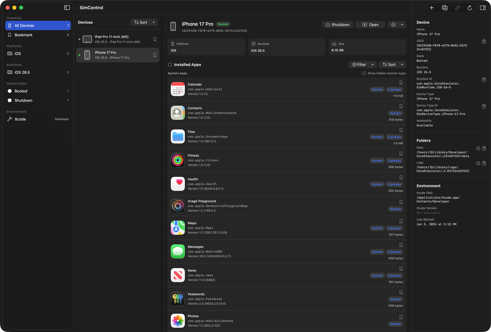

  

# SimControl

SimControl is a macOS app for Apple platform developers who want a faster way to inspect and control Xcode Simulator. Instead of repeatedly typing `simctl` commands in Terminal, you can manage simulator devices, installed apps, app containers, and developer testing tools from one focused interface.

  

## Overview

SimControl loads the simulator inventory from the active Xcode selection and presents device state, runtime, device type, storage, and installed app information in a visual workflow. It is built around the day-to-day actions developers often repeat: booting simulators, launching apps, resetting app data, opening containers, testing deep links, sending push payloads, and changing simulator conditions.

The main window helps you browse every simulator, inspect the selected device, and work with its installed apps. The menu bar extra gives quick access to frequently used devices and apps without opening the full window.

## Features

### Simulator Inventory

- Refresh simulator inventory from the active Xcode selection.
- View device name, platform, runtime, state, and availability.
- Search and filter to quickly find the simulator or app you need.
- Inspect selected simulator details, storage, recent boot information, and identifiers.

### Simulator Management

- Boot and shut down simulator devices.
- Create new simulators, clone existing simulators, and rename devices.
- Pair iPhone and Apple Watch simulators, or remove existing pairs.
- Erase or delete simulators with confirmation flows for destructive actions.
- Open Simulator.app directly from SimControl.

### Device Files And Identifiers

- Open simulator data and log folders in Finder.
- Copy data paths, log paths, UDIDs, runtime identifiers, and device type identifiers.
- Handle repeated simulator path tasks directly inside the app.

### Installed App Management

- View user apps and system apps installed on the selected simulator.
- Inspect app names, bundle identifiers, versions, builds, and data container sizes.
- Show real app icons when available, with a consistent fallback icon when needed.
- Filter apps by app type, App Group presence, and database file presence.
- Sort apps by name, bundle identifier, version, or data size.
- Bookmark frequently used apps for quick access from the menu bar.

### App Commands And Containers

- Launch and terminate installed apps.
- Uninstall apps or reset an app sandbox.
- Open or copy app bundle and data container paths.
- Open or copy App Group container paths.
- Install the same app bundle on another compatible simulator and launch it there.

### Developer Testing Tools

- Open deep link URLs on the selected simulator.
- Send remote notification payloads to test push notification flows.
- Grant, revoke, or reset privacy permissions such as Camera, Location, Photos, Microphone, and Notifications.
- Set simulator location using presets such as Apple Park, San Francisco, London, Tokyo, and Seoul, or enter custom coordinates.
- Clear simulator location overrides.
- Apply or clear status bar overrides for time, data network, Wi-Fi, cellular mode, carrier name, and battery state.

### Menu Bar Access

- Open the SimControl main window or Simulator.app from the menu bar.
- Refresh simulator inventory from the menu bar.
- Quickly access bookmarked devices, bookmarked apps, and recent apps.
- Open settings or quit SimControl without switching context.

### Settings

- Toggle launch at login.
- Toggle the menu bar extra.
- Enable or disable confirmation for destructive actions such as erase, delete, uninstall, and sandbox reset.
- Choose the Xcode Developer Directory used by simulator commands.
- Configure the link folder path and diagnostics collection.

## Useful For

- App development that frequently moves across runtimes and device combinations.
- Debugging app sandboxes, App Groups, and database files.
- QA flows that repeatedly change deep links, push payloads, location, permissions, or status bar conditions.
- Developers who prefer a visual CoreSimulator control surface over repeated Terminal commands.

## License
MIT license. See [LICENSE](https://github.com/Jaesung-Jung/XcodeSimulatorManager/blob/main/LICENSE) for details.
