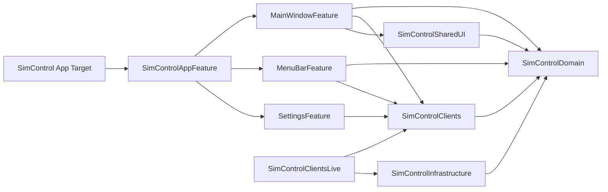

# isowords 기반 SimControl 모듈화 아키텍처

**작성일:** 2026-06-04

## 목적

SimControl의 아키텍처 개선과 Swift Package 기반 모듈화를 함께 진행한다. 레퍼런스는 Point-Free의 `pointfreeco/isowords`이며, 그대로 복제하지 않고 SimControl의 규모와 현재 코드 상태에 맞게 축약 적용한다.

## isowords에서 가져올 원칙

`isowords`는 TCA 개발팀이 만든 프로젝트답게 매우 강한 Swift Package 모듈화를 사용한다. 관찰한 핵심은 다음과 같다.

- 루트 `Package.swift`가 앱/서버/공유 코드를 여러 target으로 나눈다.
- 하나의 큰 앱 feature가 여러 작은 feature target을 조합한다.
- domain model은 `SharedModels`, client model은 `ClientModels`처럼 별도 target으로 분리한다.
- 외부 효과는 `ApiClient`, `FileClient`, `UserDefaultsClient` 같은 dependency client target으로 표현한다.
- live 구현은 `ApiClientLive`처럼 client interface와 분리할 수 있다.
- client target 내부에서도 `Client.swift`, `LiveKey.swift`, `TestKey.swift`를 분리해 interface/live/test 책임을 구분한다.
- feature preview app을 별도로 두어 `HomeFeature`, `OnboardingFeature` 같은 feature를 독립 실행할 수 있게 한다.
- resource는 feature 또는 styleguide target에 소유시킨다.
- app target은 composition root 역할에 집중한다.

SimControl에 그대로 적용하지 않을 점도 분명하다.

- isowords처럼 80개 이상의 target으로 시작하지 않는다.
- 서버/미들웨어/웹 라우팅 target은 SimControl에 필요 없다.
- 현재 Xcode project를 즉시 `App/` 아래로 옮기지 않는다.
- 기능별 preview app은 초기 목표가 아니라 후반부 선택지로 둔다.

## SimControl 현재 문제와 대응

현재 SimControl의 가장 큰 문제는 모든 코드가 하나의 app target에 있기 때문에 의존성 방향이 컴파일러로 강제되지 않는다는 점이다.

특히 다음 문제가 모듈화와 함께 해결되어야 한다.

- `MainWindowFeature`가 refresh, sheet, device command, app command, developer tools, path action orchestration을 모두 소유한다.
- `WorkspaceFeature.State`가 snapshot projection, filtering, sorting, selection reconciliation, child feature state 생성을 모두 수행한다.
- `Services` 폴더 안에 concrete service와 TCA dependency client가 섞여 있다.
- `AppContainer` live wiring과 `DependencyKey.liveValue` 경로가 중복된다.
- placeholder type이 실제 경계처럼 보이지만 아직 책임이 없다.

## 목표 모듈 그래프

초기 목표는 isowords의 원칙을 축약한 다음 구조다.



## Target 책임

### `SimControlDomain`

순수 domain model과 순수 query rule을 소유한다.

포함 후보:

- `SimulatorSnapshot`
- `SimulatorDevice`
- `SimulatorRuntime`
- `SimulatorDeviceType`
- `InstalledApp`
- `AppGroupContainer`
- `DevicePair`
- `XcodeSelection`
- `SimulatorWarning`
- `CommandResult`
- `SimulatorFilters`
- `SimulatorInventoryQuery`
- `SimulatorSelection`
- `WorkspaceProjectionInput`

규칙:

- `SwiftUI` import 금지.
- `ComposableArchitecture` import 금지.
- process/file I/O 금지.
- UI feature state를 반환하지 않는다.

### `SimControlInfrastructure`

외부 세계와 직접 통신하는 concrete implementation을 소유한다.

포함 후보:

- `CommandExecutor`
- `CoreSimulatorService`
- `AppContainerScanner`
- `PathActionService`
- `AppSandboxResetService`
- `SimulatorRepository`
- `Simctl*` DTO

규칙:

- `SimControlDomain`에 의존한다.
- `ComposableArchitecture` import 금지.
- `DependencyKey` conformance를 두지 않는다.
- live factory에 필요한 concrete type은 이 target에 둔다.

### `SimControlClients`

feature가 사용하는 dependency interface를 소유한다.

포함 후보:

- `CoreSimulatorClient`
- `SimulatorRepositoryClient`
- `PathActionClient`
- `AppSandboxResetClient`
- `UserSettingsClient`
- `ActionLogClient`

isowords식 패턴:

```swift
import DependenciesMacros

@DependencyClient
public struct CoreSimulatorClient: Sendable {
  public var bootDevice: @Sendable (_ id: String) async -> CommandResult
  public var shutdownDevice: @Sendable (_ id: String) async -> CommandResult
}
```

규칙:

- concrete service를 만들지 않는다.
- live 구현을 갖지 않는다.
- `TestKey.swift` 또는 같은 역할의 extension에서 `testValue = Self()`와 `previewValue`를 정의한다.

### `SimControlClientsLive`

dependency client의 live 구현을 소유한다.

포함 후보:

- `CoreSimulatorClient+Live.swift`
- `SimulatorRepositoryClient+Live.swift`
- `PathActionClient+Live.swift`
- `AppSandboxResetClient+Live.swift`
- `AppDependencyEnvironment.swift`

규칙:

- `SimControlClients`와 `SimControlInfrastructure`에 의존한다.
- `DependencyKey.liveValue` 또는 explicit live factory를 여기에 둔다.
- app target이 같은 live instance를 공유할 수 있게 factory를 제공한다.

### `SimControlSharedUI`

공통 SwiftUI view와 표시 helper를 소유한다.

포함 후보:

- `StatusBadge`
- `SectionHeader`
- `EmptyStateView`
- design token 또는 formatting helper

규칙:

- 가능하면 `SimControlDomain`과 SwiftUI만 의존한다.
- feature-specific state를 import하지 않는다.

### `MainWindowFeature`

main window의 TCA reducer와 SwiftUI view를 소유한다.

포함 후보:

- `MainWindowFeature`
- `WorkspaceFeature`
- `DeviceListFeature`
- `DeviceDetailFeature`
- `InstalledAppsFeature`
- `DeveloperToolsFeature`
- `InspectorFeature`
- main window view files
- create/clone/rename/pair confirmation views

초기에는 하나의 target으로 묶고, 안정화 후 필요하면 다음 target으로 나눈다.

- `InventoryFeature`
- `DeviceLifecycleFeature`
- `InstalledAppsFeature`
- `DeveloperToolsFeature`

### `MenuBarFeature`

menu bar extra UI와 action routing을 소유한다.

포함 후보:

- `MenuBarRootView`
- `MenuBarAppActionsView`
- `MenuBarDeviceSection`

### `SettingsFeature`

settings scene UI와 설정 state/client를 소유한다.

포함 후보:

- `SettingsRootView`
- `GeneralSettingsView`
- `XcodeSettingsView`
- `SafetySettingsView`
- `MenuBarSettingsView`
- `DiagnosticsSettingsView`
- `LinkFolderSettingsView`

### `SimControlAppFeature`

앱 수준 composition reducer 또는 top-level scene state를 소유한다.

초기에는 생략할 수 있다. `MainWindowFeature`, `MenuBarFeature`, `SettingsFeature` 분리가 완료된 뒤 도입한다.

### `SimControl` App Target

최종 app target은 다음만 소유한다.

- `SimControlApp`
- `AppDelegate`
- `AppContainer`
- `AppSceneID`
- assets
- app-level localization resource
- live dependency wiring

## Package 배치

초기에는 루트 `Package.swift`보다 local package를 권장한다.

```text
Packages/
  SimControlModules/
    Package.swift
    Sources/
      SimControlDomain/
      SimControlInfrastructure/
      SimControlClients/
      SimControlClientsLive/
      SimControlSharedUI/
      MainWindowFeature/
      MenuBarFeature/
      SettingsFeature/
    Tests/
      SimControlDomainTests/
      SimControlInfrastructureTests/
      SimControlClientsTests/
      MainWindowFeatureTests/
      MenuBarFeatureTests/
      SettingsFeatureTests/
```

이유:

- 현재 root에는 `SimControl.xcodeproj`가 있다.
- local package 추가가 Xcode project 이동보다 작고 안전하다.
- target 분리와 build 검증을 먼저 끝낸 뒤, 원하면 isowords처럼 root `Package.swift` + `App/` 구조로 바꿀 수 있다.

## 단계별 목표

### 1단계: Package skeleton과 Domain target

`Packages/SimControlModules/Package.swift`를 만들고 `SimControlDomain`부터 이동한다.

이 단계의 목표:

- 가장 의존성이 낮은 domain부터 compile-time boundary를 만든다.
- domain test를 app test target에서 package test target으로 옮긴다.

### 2단계: 순수 inventory query 추출

`WorkspaceFeature.State`의 filtering/sorting/selection reconciliation을 domain query로 추출한다.

이 단계의 목표:

- projection rule을 TCA state에서 분리한다.
- `WorkspaceFeatureTests` 중 순수 로직 테스트를 package test로 옮긴다.

### 3단계: Infrastructure target

`CommandExecutor`, `CoreSimulatorService`, `AppContainerScanner`, `SimulatorRepository`, `Simctl*` DTO를 `SimControlInfrastructure`로 이동한다.

이 단계의 목표:

- process/file I/O 구현을 한 target으로 묶는다.
- infrastructure가 TCA에 의존하지 않도록 만든다.

### 4단계: Client와 Live 분리

현재 `CoreSimulatorServiceClient`, `SimulatorRepositoryClient`, `PathActionClient`, `AppSandboxResetClient`를 isowords식 `Client.swift`, `LiveKey.swift`, `TestKey.swift` 패턴으로 재구성한다.

이 단계의 목표:

- feature는 client interface에만 의존한다.
- live implementation은 `SimControlClientsLive`에서 조립한다.
- `AppContainer`는 live object graph를 하나만 만든다.

### 5단계: MainWindowFeature 축소

`MainWindowFeature`에서 긴 command workflow를 분리한다.

우선 target 분리보다 책임 분리가 먼저다.

후보:

- `InventoryWorkflowClient`
- `DeviceLifecycleWorkflowClient`
- `InstalledAppWorkflowClient`
- `DeveloperToolWorkflowClient`
- `PathActionWorkflowClient`

이 단계의 목표:

- `MainWindowFeature`는 workflow를 시작하고 결과를 적용하는 composition reducer가 된다.
- 반복되는 refresh-after-command 패턴을 줄인다.

### 6단계: Feature target 이동

`MainWindowFeature`, `MenuBarFeature`, `SettingsFeature`, `SimControlSharedUI`를 package target으로 옮긴다.

이 단계의 목표:

- app target에서 feature 구현을 제거한다.
- app target은 scene과 dependency wiring에 집중한다.

### 7단계: Preview app 또는 preview harness 도입

isowords의 feature preview app 방식을 SimControl 규모에 맞게 적용한다.

후보:

- `MainWindowPreviewApp`
- `MenuBarPreviewApp`
- `SettingsPreviewApp`

초기에는 별도 Xcode app target 대신 package-local preview fixture와 SwiftUI preview만 정리해도 된다.

### 8단계: Root package 전환 여부 결정

모듈화가 안정되면 다음 중 하나를 선택한다.

- 현재 `Packages/SimControlModules` 유지.
- isowords처럼 root `Package.swift`로 승격하고 app project를 `App/` 아래로 이동.

권장 기본값은 유지다. root package 전환은 기능적 이득보다 repository layout 변경 비용이 크다.

## 금지할 의존성

다음 import는 실패로 간주한다.

```text
SimControlDomain -> SwiftUI
SimControlDomain -> ComposableArchitecture
SimControlInfrastructure -> ComposableArchitecture
SimControlInfrastructure -> SwiftUI
SimControlClients -> SimControlInfrastructure
SimControlSharedUI -> MainWindowFeature
MenuBarFeature -> MainWindowFeature
SettingsFeature -> MainWindowFeature
```

## 검증 명령

패키지 도입 후 기본 검증:

```bash
swift test --package-path Packages/SimControlModules
xcodebuild test -project SimControl.xcodeproj -scheme SimControl -destination 'platform=macOS'
```

의존성 방향 검증:

```bash
rg "import SwiftUI|import ComposableArchitecture" Packages/SimControlModules/Sources/SimControlDomain
rg "import SwiftUI|import ComposableArchitecture" Packages/SimControlModules/Sources/SimControlInfrastructure
rg "import SimControlInfrastructure" Packages/SimControlModules/Sources/SimControlClients
```

위 명령들은 결과가 없어야 한다.

## 참고 자료

- `pointfreeco/isowords`: https://github.com/pointfreeco/isowords
- isowords `Package.swift`: https://github.com/pointfreeco/isowords/blob/main/Package.swift
- isowords README의 TCA/modularization 설명: https://github.com/pointfreeco/isowords
- swift-dependencies `@DependencyClient` 문서: https://github.com/pointfreeco/swift-dependencies/blob/main/Sources/Dependencies/Documentation.docc/Articles/DesigningDependencies.md
