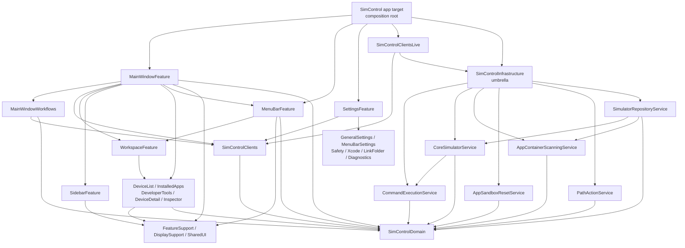

# isowords 기반 SimControl 모듈화 아키텍처

**작성일:** 2026-06-04
**현 상태:** Swift Package target 분리 진행 완료, MainWindowFeature 책임 재설계 진행 중

## 목적

SimControl의 아키텍처를 `pointfreeco/isowords`의 방향성에 맞춰 재구성한다. 그대로 복제하지는 않고, SimControl의 macOS 앱 규모에 맞게 다음 원칙을 적용한다.

- 앱 타깃은 composition root로 축소한다.
- domain, client interface, live adapter, workflow, feature, concrete service를 컴파일 타임 모듈로 분리한다.
- 큰 feature는 작은 feature target 또는 child reducer를 조합하되, 파일 줄 수가 아니라 독립 책임을 기준으로 경계를 정한다.
- concrete service는 feature/client/workflow 레이어에서 직접 생성하지 않는다.
- 모듈 경계는 `scripts/verify-modularization.sh`로 반복 검증한다.

## 중요한 방향 정정

이 문서의 목적은 100-200줄 파일을 기계적으로 더 작은 extension 파일로 쪼개는 것이 아니다. 파일 분리는 책임 경계를 드러내기 위한 임시 수단일 수 있지만, 그 자체가 성공 기준은 아니다.

성공 기준은 다음과 같다.

- `MainWindowFeature`가 device lifecycle, installed app command, developer tool command, path action, inventory refresh sequence를 직접 모두 실행하지 않는다.
- 반복 command sequence는 `MainWindowWorkflows` 또는 실제 child feature reducer가 소유한다.
- `MainWindowFeature`는 scene composition, navigation/sheet routing, child action delegation, workflow response application에 집중한다.
- 테스트도 파일 크기가 아니라 경계별로 이동한다. command sequence는 workflow test, UI intent는 child feature test, scene delegation은 main window reducer test로 검증한다.
- 과도하게 늘어난 `MainWindowFeature+...` extension 파일은 최종 구조가 아니다. 다음 단계에서는 관련 파일을 실제 책임 단위로 합치거나 child reducer/target으로 추출한다.

## 현재 target 수

현재 `Packages/SimControlModules`에는 30개 library product가 있다. 이제 단순한 5-7개 레이어 분리가 아니라, feature와 service가 각각 작은 target으로 분리된 마이크로 모듈라이제이션 구조다.

다만 target 수가 충분하다는 사실이 아키텍처 완료를 의미하지는 않는다. 특히 `MainWindowFeature` 내부에는 여전히 scene feature가 직접 해석하는 action과 workflow response가 많고, 최근 작업으로 extension 파일 수가 늘어난 상태다. 이 부분은 파일 수를 더 늘리는 방식이 아니라 책임을 가진 child reducer와 workflow boundary로 재정리해야 한다.

### Domain

- `SimControlDomain`

### Concrete service

- `CommandExecutionService`
- `CoreSimulatorService`
- `AppContainerScanningService`
- `PathActionService`
- `AppSandboxResetService`
- `SimulatorRepositoryService`
- `SimControlInfrastructure`

`SimControlInfrastructure`는 concrete 구현을 직접 많이 소유하는 큰 모듈이 아니라, 앱 composition root가 기존처럼 편하게 import할 수 있도록 service target을 재수출하는 umbrella target이다.

### Dependency client

- `SimControlClients`
- `SimControlClientsLive`

### Workflow

- `MainWindowWorkflows`

### Feature support

- `MainWindowFeatureSupport`
- `MainWindowDisplaySupport`
- `SimControlSharedUI`

### Leaf feature

- `DeviceListFeature`
- `InstalledAppsFeature`
- `DeveloperToolsFeature`
- `DeviceDetailFeature`
- `InspectorFeature`
- `SidebarFeature`
- `WorkspaceFeature`
- `GeneralSettingsFeature`
- `MenuBarSettingsFeature`
- `SafetySettingsFeature`
- `XcodeSettingsFeature`
- `LinkFolderSettingsFeature`
- `DiagnosticsSettingsFeature`

### Scene feature

- `MainWindowFeature`
- `MenuBarFeature`
- `SettingsFeature`

## 현재 아키텍처 그래프



## 계층별 책임

### `SimControl` app target

앱 실행과 live object graph 조립만 담당한다.

- `SimControlApp`
- `AppDelegate`
- `AppContainer`
- assets
- scene 선언
- live service instance 생성
- TCA dependency 주입

규칙:

- feature 구현을 두지 않는다.
- old `Domain/`, `Features/`, `Services/`, `Repositories/`, `SharedUI/`, `State/` 폴더를 다시 만들지 않는다.
- concrete service 생성은 `AppContainer` 또는 live adapter에만 둔다.

### `SimControlDomain`

순수 domain model과 inventory query rule을 소유한다.

대표 타입:

- `SimulatorSnapshot`
- `SimulatorDevice`
- `SimulatorRuntime`
- `SimulatorDeviceType`
- `InstalledApp`
- `AppGroupContainer`
- `DevicePair`
- `XcodeSelection`
- `SimulatorWarning`
- `CommandResult`
- `SimulatorFilters`
- `SimulatorInventoryQuery`
- `SimulatorInventorySelection`

규칙:

- `SwiftUI`, `AppKit`, `ComposableArchitecture`, `Dependencies` import 금지.
- process/file I/O 금지.
- UI feature state를 반환하지 않는다.

### Concrete service targets

외부 세계와 직접 통신하는 구현을 작은 target 단위로 나눈다.

- `CommandExecutionService`: process 실행, stdout/stderr 수집, timeout 처리.
- `CoreSimulatorService`: `simctl` 명령 실행과 simctl DTO decode.
- `AppContainerScanningService`: simulator app/container 파일 스캔.
- `PathActionService`: Finder 열기, clipboard 복사 같은 macOS path action.
- `AppSandboxResetService`: 앱 sandbox reset 구현.
- `SimulatorRepositoryService`: core simulator 결과와 app container scan 결과를 domain snapshot으로 조립.
- `SimControlInfrastructure`: 위 service target들을 재수출하는 umbrella.

규칙:

- service target은 feature/client/workflow/infrastructure umbrella를 import하지 않는다.
- 대부분의 service target은 `Foundation`과 `SimControlDomain` 중심으로 유지한다.
- `PathActionService`의 `AppKit` import는 Finder/clipboard 연동을 위한 예외다.
- TCA dependency key를 두지 않는다.

### `SimControlClients`

feature와 workflow가 사용하는 dependency interface를 소유한다.

대표 client:

- `CoreSimulatorClient`
- `SimulatorRepositoryClient`
- `PathActionClient`
- `AppSandboxResetClient`
- `UserSettingsClient`

규칙:

- concrete service를 생성하지 않는다.
- `SimControlInfrastructure`를 import하지 않는다.
- live 구현을 두지 않는다.
- test/preview 기본값은 interface target 안에 둔다.

### `SimControlClientsLive`

dependency client를 concrete service에 연결하는 live adapter를 소유한다.

대표 파일:

- `CoreSimulatorClient+Live.swift`
- `SimulatorRepositoryClient+Live.swift`
- `PathActionClient+Live.swift`
- `AppSandboxResetClient+Live.swift`
- `UserSettingsClient+Live.swift`

규칙:

- `SimControlClients`와 `SimControlInfrastructure`에 의존한다.
- concrete service instance를 받아 client closure로 감싼다.
- feature target은 이 모듈을 import하지 않는다.

### `MainWindowWorkflows`

main window에서 발생하는 command orchestration을 reducer 밖으로 분리한다.

대표 workflow:

- `InventoryWorkflowClient`
- `DeviceLifecycleWorkflowClient`
- `InstalledAppWorkflowClient`
- `DeveloperToolWorkflowClient`
- `PathActionWorkflowClient`

규칙:

- `SimControlClients`와 `SimControlDomain`에만 의존한다.
- live 구현이나 concrete service를 import하지 않는다.
- reducer는 workflow를 호출하고 결과 반영에 집중한다.

### Feature support targets

feature 간 공유되지만 domain은 아닌 타입과 표시 helper를 소유한다.

- `MainWindowFeatureSupport`: command state, command enum, availability enum.
- `MainWindowDisplaySupport`: domain value의 화면 표시 문자열/색상 보조.
- `SimControlSharedUI`: `StatusBadge`, `SectionHeader`, `EmptyStateView`.

규칙:

- shared UI는 특정 feature state를 import하지 않는다.
- support target은 concrete service나 live client를 모른다.

### Leaf feature targets

작은 화면/영역 단위의 TCA reducer와 view를 소유한다.

- `DeviceListFeature`
- `InstalledAppsFeature`
- `DeveloperToolsFeature`
- `DeviceDetailFeature`
- `InspectorFeature`
- `SidebarFeature`
- `WorkspaceFeature`
- `GeneralSettingsFeature`
- `MenuBarSettingsFeature`
- `SafetySettingsFeature`
- `XcodeSettingsFeature`
- `LinkFolderSettingsFeature`
- `DiagnosticsSettingsFeature`

규칙:

- domain, support, shared UI, TCA에 의존한다.
- concrete service와 live client를 직접 import하지 않는다.
- `WorkspaceFeature`는 leaf feature state를 조합하지만 command execution을 직접 수행하지 않는다.
- settings child feature는 한 settings section의 reducer/state/view만 소유하고, root `SettingsFeature`나 sibling settings target을 import하지 않는다.

### Scene feature targets

앱 scene 단위의 feature를 소유한다.

- `MainWindowFeature`: 현재는 main window reducer, view, sheet/confirmation, workflow 호출을 소유한다. 목표는 scene composition, navigation/sheet routing, child action delegation으로 축소하는 것이다.
- `MenuBarFeature`: menu bar extra UI, menu bar state projection, menu-specific action.
- `SettingsFeature`: settings scene reducer, child settings composition, SwiftUI root view, user settings persistence orchestration.

`MenuBarFeature`는 `MainWindowFeature`를 import하지 않는다. `MainWindowFeature`가 `WorkspaceFeature.State`에서 `MenuBarFeature.State`를 파생하고, `MenuBarFeature.Action`을 기존 refresh, open simulator, workspace selection workflow로 해석한다.

`SettingsFeature`는 `GeneralSettingsFeature`, `MenuBarSettingsFeature`, `SafetySettingsFeature`, `XcodeSettingsFeature`, `LinkFolderSettingsFeature`, `DiagnosticsSettingsFeature`를 조합하고 `SimControlClients.UserSettingsClient`만 사용한다. 사용자 설정의 live 저장 방식은 `SimControlClientsLive`가 `UserDefaults` adapter로 제공하고, 앱 target의 `AppContainer`가 `settingsStore`에 주입한다. 따라서 Settings scene은 독립적인 TCA feature로 테스트할 수 있고, concrete 저장 구현은 feature target 밖에 머문다.

## isowords에서 가져온 원칙

- 앱 타깃은 feature 구현이 아니라 composition root다.
- 큰 feature는 여러 작은 feature target을 조합한다.
- 외부 효과는 dependency client interface와 live implementation으로 분리한다.
- domain model은 feature, UI, live 구현으로부터 독립시킨다.
- resource와 preview fixture는 가능하면 소유 feature target에 둔다.
- 모듈 경계는 문서가 아니라 빌드와 테스트로 강제한다.

## 금지 의존성

`scripts/verify-modularization.sh`에서 다음 규칙을 검사한다. 이 스크립트는 줄 수를 아키텍처 품질 기준으로 삼지 않고, import 방향과 target 경계를 반복 검증한다.

- `SimControlDomain`은 UI, TCA, dependency, 상위 모듈을 import하지 않는다.
- 순수 service target은 UI/AppKit, TCA, dependency, 상위 모듈을 import하지 않는다.
- service target은 feature/client/workflow/infrastructure umbrella layer를 import하지 않는다.
- `SimControlInfrastructure`는 UI feature, TCA, dependency client layer를 import하지 않는다.
- `SimControlClients`는 live 구현, concrete infrastructure, UI/TCA layer를 import하지 않는다.
- `SimControlClientsLive`는 feature/workflow layer를 import하지 않는다.
- `MainWindowWorkflows`는 live 구현, concrete infrastructure, UI/TCA layer를 import하지 않는다.
- feature target은 `SimControlInfrastructure`, `SimControlClientsLive`를 직접 import하지 않는다.
- `SettingsFeature`는 `MainWindowFeature`, `MenuBarFeature`, live/infrastructure layer를 직접 import하지 않는다.
- settings child feature는 root `SettingsFeature`, sibling settings target, client/live/infrastructure layer를 직접 import하지 않는다.
- `MenuBarFeature`는 `MainWindowFeature`를 직접 import하지 않는다.
- feature/workflow/client interface layer에서는 concrete service를 직접 생성하지 않는다.

## 검증 명령

전체 검증:

```bash
scripts/verify-modularization.sh
```

개별 검증:

```bash
swift test --package-path Packages/SimControlModules
xcodebuild test -project SimControl.xcodeproj -scheme SimControl -destination 'platform=macOS,arch=arm64,name=My Mac' -parallel-testing-enabled NO
```

## 남은 핵심 작업

현재 구조는 local package 방식으로 빌드 가능한 상태까지 왔다. 하지만 `MainWindowFeature` 책임 축소는 아직 끝나지 않았다. 다음 작업은 선택 사항이 아니라 아키텍처 개선의 본류다.

- `MainWindowFeature`에 흩어진 device lifecycle, installed app, developer tool, path action action handling을 실제 child reducer 또는 workflow boundary로 옮긴다.
- 현재 과도하게 쪼개진 `MainWindowFeature+...` extension 파일은 책임 단위가 확정될 때 통합하거나 target으로 승격한다.
- `MainWindowFeatureTests`에 남은 scenario를 workflow test, child feature test, scene delegation test로 재배치한다.
- resource/localization은 feature target 소유권에 맞게 정리한다.
- root `Package.swift` 승격은 위 책임 경계가 안정된 뒤 다시 결정한다.

현 단계에서는 root package 승격보다 현재 local package 구조를 유지하는 쪽이 더 비용 대비 효과가 좋다.

## 참고 자료

- `pointfreeco/isowords`: https://github.com/pointfreeco/isowords
- isowords `Package.swift`: https://github.com/pointfreeco/isowords/blob/main/Package.swift
- swift-dependencies dependency 설계 문서: https://github.com/pointfreeco/swift-dependencies/blob/main/Sources/Dependencies/Documentation.docc/Articles/DesigningDependencies.md
