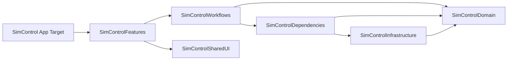

# SimControl 아키텍처 개선 설계

**작성일:** 2026-06-03

## 목표

SimControl을 유지보수하기 쉬운 구조로 재정리한다. 도메인 모델, CoreSimulator 연동, 애플리케이션 워크플로우, SwiftUI/TCA 프레젠테이션의 경계를 명확히 하고, 거대한 reducer에 집중된 압력을 줄이며, 의존성 방향을 컴파일러가 검증할 수 있는 Swift Package 모듈화까지 단계적으로 준비한다.

핵심은 대규모 재작성 없이 현재 코드의 좋은 부분을 보존하면서 경계를 세우는 것이다.

## 현재 아키텍처

현재 SimControl은 하나의 macOS 앱 타깃과 하나의 테스트 타깃으로 구성되어 있다. 소스 파일은 다음 폴더 단위로 나뉘어 있다.

- `App`: 앱 진입점과 의존성 조립.
- `Domain`: `SimulatorSnapshot`, `SimulatorDevice`, `InstalledApp`, `CommandResult` 같은 값 모델.
- `Services`: 프로세스 실행, `simctl` wrapper, 파일시스템 스캔, 경로 액션, reset 액션, TCA dependency client.
- `Repositories`: snapshot refresh와 service payload에서 domain model로의 매핑.
- `Features`: SwiftUI/TCA feature와 view.
- `SharedUI`: 작은 재사용 SwiftUI 컴포넌트.
- `State`: filter와 현재 비어 있는 placeholder store.

현재 구조에도 이미 활용할 만한 경계가 있다.

- `CoreSimulatorService`는 `xcode-select`, `xcrun simctl`, `open` 명령 실행 wrapper로 역할이 비교적 분명하다.
- `CommandExecutor`는 프로세스 실행을 격리한다.
- `SimulatorRepository`는 snapshot 생성과 in-flight refresh 공유를 담당한다.
- Domain model은 대부분 순수 값 타입이며 I/O를 수행하지 않는다.
- Swift Testing과 TCA `TestStore` 기반 테스트가 이미 존재한다.

## 아키텍처 문제

### 1. MainWindowFeature가 너무 많은 책임을 가진다

`MainWindowFeature`는 앱 최초 refresh, 메뉴바 자동 refresh 정책, sheet 표시, device lifecycle command, app lifecycle command, app container path action, developer tool command, command 이후 refresh orchestration, command result logging을 모두 결합하고 있다.

결과적으로 `MainWindowFeature`의 action 목록과 reducer body가 사실상의 workflow layer가 되었다.

이 구조의 비용은 다음과 같다.

- 새 simulator command를 추가할 때마다 focused workflow unit 대신 root reducer가 커진다.
- 테스트가 `MainWindowFeatureTests`로 집중된다. 이미 주변 feature test보다 훨씬 크다.
- UI state, workflow state, service command sequence를 독립적으로 이해하기 어렵다.
- 여러 command flow가 같은 패턴을 반복한다. state 검증, running state 설정, service 호출, command result 추가, inventory refresh, selection reconciliation이 반복된다.

### 2. Workspace State가 projection engine과 feature state를 동시에 맡는다

`WorkspaceFeature.State`는 canonical snapshot, filter, selection, command state, 그리고 device list/detail/inspector/installed apps/developer tools용 파생 child state를 모두 소유한다.

selection, refresh, filter 변경이 발생하면 mutation method가 child state의 상당 부분을 다시 만든다. 이 동작은 현재 앱에 필요하지만, 책임의 이름과 경계가 분명하지 않다. 실제로는 일반 reducer state라기보다 순수 `WorkspaceProjection` 또는 `SimulatorInventoryViewModel`에 가깝다.

projection 규칙이 TCA state 내부에 남아 있으면 다음 문제가 생긴다.

- 작은 단위로 재사용하기 어렵다.
- TCA 없이 순수 테스트하기 어렵다.
- 향후 Swift Package로 옮길 때 경계가 모호해진다.

### 3. 의존성 조립 경로가 중복된다

`AppContainer`는 하나의 live `CommandExecutor`, `CoreSimulatorService`, `AppContainerScanner`, `SimulatorRepository`를 만들고, main store에 dependency closure를 직접 할당한다.

동시에 다음 client들은 각자 `liveValue`에서 live service instance를 만들 수 있다.

- `CoreSimulatorServiceClient.liveValue`
- `SimulatorRepositoryClient.liveValue`
- `PathActionClient.liveValue`
- `AppSandboxResetClient.liveValue`

즉 앱에는 두 가지 live assembly 경로가 존재한다.

- 명시적인 `AppContainer` 경로.
- TCA `DependencyKey.liveValue` 경로.

현재 앱은 첫 번째 경로를 사용하지만, 두 번째 경로가 남아 있어 preview, test, future store에서 별도의 live service가 실수로 만들어질 수 있다.

### 4. Infrastructure와 TCA dependency client가 한 계층에 섞여 있다

`CoreSimulatorServiceClient.swift`, `SimulatorRepositoryClient.swift`, `PathActionClient.swift`, `AppSandboxResetClient.swift`는 concrete service 옆에 있다. 이 client들은 `ComposableArchitecture`를 import하지만, concrete service 자체는 TCA가 필요하지 않다.

단일 타깃에서는 동작하지만 package boundary로는 좋지 않다. Infrastructure package는 TCA에 의존하지 않아야 한다. TCA dependency adapter는 app feature 또는 dependencies package에 있어야 한다.

### 5. Domain query 규칙이 feature state에 흩어져 있다

다음 규칙들이 `MainWindowFeature.State`와 `WorkspaceFeature.State`에 나뉘어 있다.

- compatible device type 계산.
- pairing candidate 계산.
- install target 계산.
- app filtering.
- device filtering.
- sorting.
- exact search target lookup.
- selected pair summary 계산.

이 규칙들은 `SimulatorSnapshot`과 `SimulatorFilters` 위에서 동작하는 순수 domain/query 로직이다. focused pure type으로 추출하면 전체 TCA feature state를 만들지 않고도 테스트할 수 있다.

### 6. Placeholder 타입이 구조를 흐린다

다음 타입들은 현재 비어 있거나 거의 비어 있다.

- `SettingsStore`
- `ActionLogStore`
- `ActionState`
- `SimulatorFileMonitor`
- `LinkFolderManager`
- `PermissionCoordinator`

이들은 미래 확장 지점처럼 보이지만, 아직 실제 책임을 갖지 않는다. 비어 있는 extension point는 현재 아키텍처가 실제보다 더 넓어 보이게 만들고, 어떤 경계가 진짜인지 흐린다.

### 7. 사용자 표시 문자열이 프로젝트 guideline과 아직 맞지 않는다

프로젝트 guideline은 사용자 표시 문자열에 `.localizable(...)` 사용을 요구하지만, 여러 SwiftUI view에는 아직 하드코딩된 문자열이 있다.

이것은 지금의 가장 큰 아키텍처 위험은 아니지만, UI module을 분리하면 localization resource의 소유 위치를 정해야 하므로 함께 고려해야 한다.

## 권장 아키텍처

한 번에 크게 재작성하지 말고 단계적으로 경계를 세운다.



### Target 경계

최종 의존성 방향은 다음과 같아야 한다.

- `SimControlDomain`: domain value와 pure query type. SwiftUI 없음. TCA 없음. process 또는 filesystem I/O 없음.
- `SimControlInfrastructure`: `CommandExecutor`, `CoreSimulatorService`, `AppContainerScanner`, `PathActionService`, `AppSandboxResetService`, raw `Simctl*` DTO, repository 구현. `SimControlDomain`에 의존한다.
- `SimControlDependencies`: TCA dependency client와 live/test construction helper. `SimControlDomain`, `SimControlInfrastructure`, TCA에 의존한다.
- `SimControlFeatures`: TCA reducer와 SwiftUI feature view. `SimControlDomain`, `SimControlDependencies`, `SimControlSharedUI`, TCA/SwiftUI에 의존한다.
- `SimControlSharedUI`: 재사용 SwiftUI component와 design helper. SwiftUI에 의존하고, 필요한 경우에만 `SimControlDomain`에 의존한다.
- `SimControl` app target: scene setup, `AppContainer`, app delegate, settings scene, asset, localization resource, composition root.

### 먼저 옮겨야 할 것

바로 모든 package를 만들지 않는다. 먼저 현재 app target 안에서 경계를 추출한다.

1. `WorkspaceFeature.State`에서 pure snapshot query/projection code를 추출한다.
2. `MainWindowFeature`에서 command workflow orchestration을 추출한다.
3. live dependency assembly를 하나의 composition root로 통합한다.
4. placeholder state/service type을 삭제하거나 실제 책임을 부여한다.
5. 그 다음 Swift Package를 도입한다.

이 순서는 얽힌 코드를 단순히 다른 폴더로 옮기는 package split을 피하기 위한 것이다.

## 접근안

### 선택안 A: 폴더 중심 리팩터링만 수행

단일 app target은 유지하고, 책임별로 파일만 나눈다.

장점:

- build system 위험이 가장 낮다.
- 큰 파일을 줄이는 가장 빠른 방법이다.
- package 작업 전 첫 단계로 적합하다.

비용:

- 의존성 방향은 여전히 convention에 의존한다.
- UI, workflow, domain, infrastructure가 여전히 서로 잘못 import될 수 있다.

### 선택안 B: 즉시 전체 Swift Package 분리

처음부터 모든 package를 만들고 파일을 module로 옮긴다.

장점:

- compile-time enforcement를 빠르게 얻는다.
- 이후 feature 작업에서 강한 경계를 사용할 수 있다.

비용:

- Xcode project와 package configuration 변경량이 크다.
- access control 변경이 한꺼번에 발생한다.
- 현재 숨겨진 coupling이 큰 migration 문제로 드러날 가능성이 높다.

### 선택안 C: 경계 정리 후 Package 분리

현재 target 안에서 pure boundary를 먼저 추출하고, test로 검증한 뒤 안정된 slice를 Swift Package로 이동한다.

장점:

- enforceable module을 목표로 하면서도 위험을 줄인다.
- 각 추출을 테스트가 안내할 수 있다.
- 아직 불안정한 책임을 package churn에 넣지 않는다.

비용:

- 선택안 B보다 단계가 더 많다.

권장안은 선택안 C다.

## 세부 개선 계획

### 1단계: 아키텍처 현황과 guardrail 문서화

`docs/architecture.md`에 짧은 architecture map을 작성한다. 현재 책임, 목표 target dependency, package migration rule을 기록한다.

규칙은 다음과 같이 둔다.

- Domain value와 query type은 SwiftUI 또는 TCA를 import하지 않는다.
- Infrastructure는 TCA를 import하지 않는다.
- TCA dependency client는 adapter이며 concrete service implementation이 아니다.
- Feature reducer는 state orchestration을 할 수 있지만, 긴 command workflow는 workflow client 또는 더 작은 child reducer에 둔다.
- App target만 live dependency wiring의 composition root가 된다.

검증:

- `rg "import ComposableArchitecture" SimControl/Domain SimControl/Services/Models`가 결과를 반환하지 않는다.
- `rg "import SwiftUI" SimControl/Domain SimControl/Services SimControl/Repositories`가 결과를 반환하지 않는다.

### 2단계: 순수 Workspace Projection 추출

`WorkspaceFeature.State`의 projection/query logic에서 순수 unit을 만든다.

후보 타입:

- `WorkspaceProjection`
- Input: `SimulatorSnapshot?`, `SimulatorFilters`, selected device/app IDs, command states, refresh availability.
- Output: `DeviceListFeature.State`, `DeviceDetailFeature.State`, `InspectorFeature.State`, selected IDs, visible devices/apps.

다음 책임을 reducer state 밖으로 옮긴다.

- Device filtering과 sorting.
- App filtering과 sorting.
- Exact search target lookup.
- 유효한 selected device/app reconciliation.
- Selected runtime, device type, pair summary 계산.
- Compatible install target count 계산.

테스트:

- 순수 state mutation 중심의 `WorkspaceFeatureTests` 대부분을 projection test로 이동한다.
- Reducer test에는 action routing만 남긴다.

기대 결과:

- `WorkspaceFeature.State`는 canonical state를 얇게 소유하고 projection helper를 호출한다.
- Expected state construction이 중앙화되어 feature test가 작아지고 덜 brittle해진다.

### 3단계: Command Workflow Client 추출

현재 `MainWindowFeature`에 들어 있는 command sequence를 workflow client로 추출한다.

후보 client:

- `InventoryRefreshClient`: refresh를 수행하고 command result와 snapshot outcome을 반환한다.
- `DeviceLifecycleClient`: create, clone, rename, erase, delete, pair, unpair를 처리한다.
- `InstalledAppCommandClient`: launch, terminate, uninstall, reset sandbox, install on another simulator를 처리한다.
- `DeveloperToolCommandClient`: open URL, push, privacy, location, status bar override를 처리한다.
- `PathActionWorkflowClient`: simulator/app path를 resolve하고 open/copy action을 수행한다.

이 client들은 reducer가 적용하기 쉬운 value result를 반환해야 한다.

- command state identity.
- command results.
- optional refresh result.
- preferred selected device/app IDs.
- final diagnostic state.

기대 reducer 형태:

- Root reducer는 UI state를 검증하고 workflow를 시작한다.
- Workflow client가 async command를 실행한다.
- Reducer는 하나의 workflow response를 reusable state method로 적용한다.

이렇게 하면 현재 `MainWindowFeature`에 반복되는 command pattern을 줄일 수 있다.

### 4단계: Main Window를 실제 feature domain으로 분리

Workflow 추출 후 `MainWindowFeature`를 책임별로 나눈다.

- `InventoryFeature`: `.task`, manual refresh, menu bar auto-refresh, refresh response.
- `DeviceLifecycleFeature`: create/clone/rename/erase/delete/pair/unpair sheet와 submit.
- `InstalledAppActionsFeature`: app destructive confirmation, reset sandbox, install on another simulator.
- `MainWindowFeature`: composition, navigation/sheet, action delegation.

기존 child feature는 실제로 action을 소유하거나 의도적으로 presentational한 feature가 되어야 한다.

- `DeviceListFeature`: selection, pinning, sorting.
- `InstalledAppsFeature`: selection, filter, sorting, app action intent.
- `DeveloperToolsFeature`: form editing과 validation. command execution은 담당하지 않는다.
- `DeviceDetailFeature`와 `InspectorFeature`: 주로 routing과 display state.

### 5단계: Dependency Assembly 정규화

중복된 live construction을 하나의 live assembly path로 통합한다.

권장 형태:

- `AppContainer`를 유일한 live object graph builder로 유지한다.
- 기존 service instance로 dependency client를 만드는 factory method를 추가한다.
- 앱이 standalone live default를 명시적으로 지원하려는 경우에만 `DependencyKey.liveValue`가 작은 shared factory를 호출하게 한다.
- App store는 `AppContainer`에서 명시적인 `withDependencies`로 구성하는 방식을 우선한다.

구체적 방향:

- `CoreSimulatorServiceClient.liveValue` construction을 `CoreSimulatorServiceClient.live(service:)` 같은 factory로 옮긴다.
- `SimulatorRepositoryClient.liveValue` construction을 `SimulatorRepositoryClient.live(repository:)`로 옮긴다.
- `liveValue`는 최소화하고 문서화하거나, app store construction을 항상 명시적으로 만들어 accidental usage를 제거한다.

### 6단계: Placeholder Boundary 정리

각 placeholder type은 둘 중 하나로 처리한다.

- 현재 동작이 의존하지 않으면 삭제한다.
- 다음 milestone에 포함된다면 집중된 책임을 구현한다.

대상:

- `SettingsStore`
- `ActionLogStore`
- `ActionState`
- `SimulatorFileMonitor`
- `LinkFolderManager`
- `PermissionCoordinator`

이 작업은 Xcode settings scene 또는 향후 문서가 해당 타입을 참조하는지 확인한 뒤 진행한다.

### 7단계: Swift Package 도입

1-6단계가 안정된 뒤 local package를 추가한다.

권장 package layout:

```text
Packages/
  SimControlDomain/
    Package.swift
    Sources/SimControlDomain/
    Tests/SimControlDomainTests/
  SimControlInfrastructure/
    Package.swift
    Sources/SimControlInfrastructure/
    Tests/SimControlInfrastructureTests/
  SimControlDependencies/
    Package.swift
    Sources/SimControlDependencies/
    Tests/SimControlDependenciesTests/
  SimControlFeatures/
    Package.swift
    Sources/SimControlFeatures/
    Tests/SimControlFeaturesTests/
  SimControlSharedUI/
    Package.swift
    Sources/SimControlSharedUI/
```

초기 package split은 보수적으로 진행한다.

1. `Domain`을 먼저 옮긴다.
2. Service DTO와 pure repository mapping helper를 다음에 옮긴다.
3. Infrastructure service를 옮긴다.
4. TCA dependency client를 옮긴다.
5. Feature reducer와 view는 마지막에 옮긴다.

Access control 규칙:

- module 밖에서 필요한 contract만 `public`으로 표시한다.
- 구현 detail은 각 package 내부 `internal`로 유지한다.
- public type과 method에는 `///` documentation을 추가한다.

### 8단계: Localization과 Resource 소유권 정리

Feature module이 안정된 뒤 localization resource가 어디에 있어야 하는지 결정한다.

권장 규칙:

- App-level scene name과 global command는 app target에 둔다.
- Feature-owned string은 Swift Package 도입 시 feature module과 함께 둔다.
- Shared UI string은 `SimControlSharedUI`에 둔다.

하드코딩된 user-facing string은 feature 이동 과정에서 점진적으로 변환한다.

## 테스트 전략

현재 Swift Testing 접근을 유지하되, 테스트를 아키텍처 경계별로 분리한다.

- Domain test: value semantics와 pure query rule.
- Projection test: filtering, sorting, selection reconciliation, derived state.
- Infrastructure test: command argument construction, command execution, filesystem scanning.
- Workflow test: command sequence behavior, refresh-after-command behavior, preferred selection.
- Feature reducer test: routing, state transition, sheet presentation, response application.
- App container test: stable live object graph와 dependency wiring.

즉시 사용하는 regression command:

```bash
xcodebuild test -project SimControl.xcodeproj -scheme SimControl -destination 'platform=macOS'
```

Package 도입 후에는 package별 check를 추가한다.

```bash
swift test --package-path Packages/SimControlDomain
swift test --package-path Packages/SimControlInfrastructure
swift test --package-path Packages/SimControlDependencies
swift test --package-path Packages/SimControlFeatures
```

## 마이그레이션 순서

1. Architecture documentation과 import-direction guardrail을 추가한다.
2. Pure workspace projection을 추출하고 관련 test를 이동한다.
3. 반복되는 refresh/result application helper를 추출한다.
4. Device lifecycle workflow를 추출한다.
5. App command workflow를 추출한다.
6. Developer tool workflow를 추출한다.
7. Live dependency assembly를 정규화한다.
8. Placeholder state/service type을 삭제하거나 구현한다.
9. `SimControlDomain` package를 만들고 domain model을 옮긴다.
10. Infrastructure/dependencies package를 만든다.
11. Workflow와 projection이 안정된 뒤 feature module을 옮긴다.
12. Localization과 resource를 module 소유권에 맞게 변환한다.

## 성공 기준

- `MainWindowFeature.swift`가 workflow-heavy root reducer에서 composition reducer로 줄어든다.
- Command sequence test 대부분이 `MainWindowFeatureTests`에서 workflow test로 이동한다.
- Workspace filtering/sorting/selection test가 TCA `TestStore` 없이 실행된다.
- Concrete infrastructure service가 `ComposableArchitecture`를 import하지 않는다.
- Domain package가 SwiftUI, TCA, filesystem, process dependency 없이 build된다.
- App target이 live assembly를 소유하고, feature가 concrete live service를 직접 만들지 않는다.
- Package boundary가 위에서 정의한 dependency direction을 강제한다.

## 위험과 완화 방안

- 위험: package split 과정에서 access-control 변경량이 커진다.
  완화: pure boundary를 먼저 추출하고 안정된 API만 package로 옮긴다.

- 위험: reducer test가 추출 과정에서 brittle해진다.
  완화: reducer test를 줄이기 전에 pure state expectation을 projection/workflow test로 이동한다.

- 위험: live dependency assembly 변경으로 여러 repository/service instance가 실수로 만들어진다.
  완화: `AppContainerTests`를 유지하고, 하나의 repository instance가 모든 live client에서 공유되는지 검증하는 test를 추가한다.

- 위험: localization resource가 흩어진다.
  완화: resource ownership rule을 문서화하기 전에는 feature package 이동을 늦춘다.

## 즉시 다음 단계

Package 생성이 아니라 2단계부터 시작한다. 가장 좋은 첫 기술 변경은 `WorkspaceProjection` 추출이다. 이 작업은 pure하고, test하기 쉽고, 위험이 낮으며, 향후 package boundary가 강제할 수 있는 깨끗한 domain/query 경계를 만든다.
